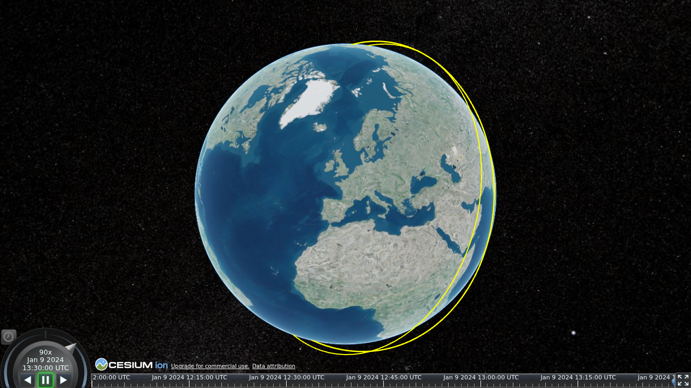

# Ground track

The sub-satellite ground track: the orbit projected to the point directly beneath the satellite at
each epoch, emitted as a geodetic polyline that floats at the satellite's own height over the
correct ground position.

{ width="520" }

```python
from gmat_czml import to_czml

to_czml(trajectory, ground_track=True).save("orbit.czml")
```

## Off by default — and why

`ground_track` is **off** unless you ask for it. The ground track is the only conversion that needs
the inertial → Earth-fixed → geodetic rotation (precession / nutation / Earth-orientation), which
loads astropy transitively. Keeping it opt-in means the core [orbit-path](orbit-path.md) conversion
stays light: a plain `to_czml(trajectory)` never loads that machinery.

The rotation and the WGS84 geodetic projection are delegated to orbit-formats — gmat-czml carries no
Earth-orientation code of its own — so the accuracy is rigorous and there is no second
implementation to keep in sync.

## What the converter does

**The geodetic polyline.** The sub-satellite longitude / latitude / height series becomes a CZML
polyline of `cartographicDegrees` — `[lon, lat, height, …]`, longitude and latitude in degrees,
height in metres. The track follows the satellite's own geodetic height, so it floats over the
correct ground position rather than being clamped to the surface, and uses the `GEODESIC` arc type
so each segment follows the shortest ground path between samples.

**The antimeridian split.** A track crossing ±180° longitude is broken into contiguous segments,
each its own polyline, with an interpolated seam point placed exactly on the dateline at both ends
of the break — so the rendered track neither draws a spurious line back across the globe nor leaves
a gap at the crossing.

**Earth only.** The projection is WGS84 / Earth-fixed, so the ground track is Earth-only. A
trajectory *declared* about another central body is rejected rather than mis-projected; an
undeclared body is accepted, since every recognised frame is already an Earth frame.

## Packets

A single-segment track is emitted as one packet, `<object>/groundtrack`. A track split at the
antimeridian numbers its segments `<object>/groundtrack/0`, `<object>/groundtrack/1`, …. A
degenerate track with no renderable segment yields no packets.

## Styling

The ground track uses the same baked-in `sat-default` style as the orbit path, drawn a touch heavier
so it reads clearly against the globe. Customization arrives with the [style system](../styling.md).
