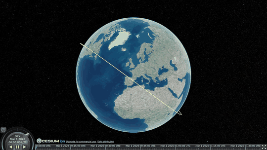
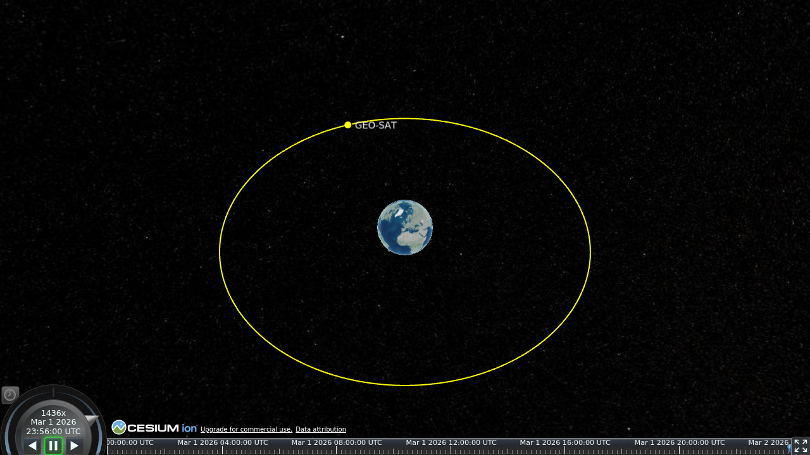
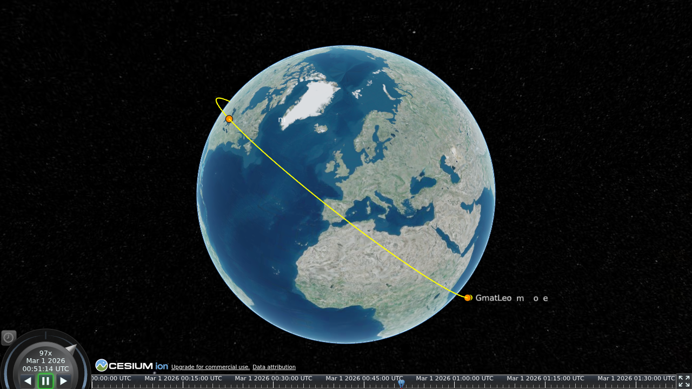
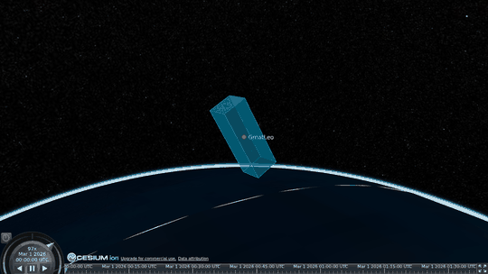

# Gallery

Runnable examples — three producer archetypes and three v0.2 annotation entities. Each lives under
[`examples/`](https://github.com/astro-tools/gmat-czml/tree/main/examples) and writes a `.czml` you
can open in any Cesium client — see [viewing the output](getting-started.md#viewing-the-result).

Run them from the repository root with the package installed:

```bash
python examples/leo_ground_track.py
python examples/geo.py
python examples/skyfield_tle.py      # needs Skyfield: pip install skyfield
python examples/contacts_mission.py
python examples/maneuver_mission.py
python examples/attitude_mission.py
```

The images below are rendered with [Cesium ion](https://cesium.com/platform/cesium-ion/) world
imagery.

## LEO with ground track — from a GMAT ephemeris

The flagship interop case: a trajectory GMAT already computed, read from a CCSDS-OEM and converted
with the ground track enabled.

{ width="640" }

```python
from orbit_formats import read
from gmat_czml import to_czml

trajectory = read("examples/data/gmat-leo.oem")
to_czml(trajectory, ground_track=True).save("leo-ground-track.czml")
```

Source: [`examples/leo_ground_track.py`](https://github.com/astro-tools/gmat-czml/blob/main/examples/leo_ground_track.py).

## A geostationary orbit — built in code

Not every producer is a file reader. This one builds a circular geostationary orbit directly as the
[canonical schema](schema.md), proving the schema — not a GMAT file — is the real input contract.

{ width="520" }

Source: [`examples/geo.py`](https://github.com/astro-tools/gmat-czml/blob/main/examples/geo.py).

## A non-GMAT producer — an ISS TLE via Skyfield

A TLE propagated by [Skyfield](https://rhodesmill.org/skyfield/) — no GMAT anywhere — through the
same one call, ground track included.

{ width="520" }

Source: [`examples/skyfield_tle.py`](https://github.com/astro-tools/gmat-czml/blob/main/examples/skyfield_tle.py).

## Contacts — ground stations and a windowed line of sight

The GMAT LEO again, with two ground stations and the access windows between each station and the
satellite. Each observer is placed on the globe, and a line of sight is drawn **only while the
station can see the spacecraft** — so a link appears as the pass begins and clears when it ends.

{ width="520" }

```python
from orbit_formats import read
from gmat_czml import Contact, GroundStation, to_czml

trajectory = read("examples/data/gmat-leo.oem")
contact = Contact(observer=GroundStation("Station-A", latitude=45.5, longitude=-9.9), target="GmatLeo", windows=windows)
to_czml(trajectory, contacts=[contact], ground_track=True).save("contacts.czml")
```

The example computes plausible windows by placing each station beneath the satellite at a chosen
instant; a real mission gets them from an access tool. See [Contacts](conversion/contacts.md). Source:
[`examples/contacts_mission.py`](https://github.com/astro-tools/gmat-czml/blob/main/examples/contacts_mission.py).

## Maneuvers — impulsive and finite burns

An impulsive burn pinned on the orbit where it happens, and a finite burn drawn as a highlighted arc
over the span it fires, each labelled with its Δv.

{ width="520" }

```python
from orbit_formats import read
from gmat_czml import to_czml

trajectory = read("examples/data/gmat-leo.oem")
to_czml(trajectory, maneuvers=maneuvers).save("maneuvers.czml")
```

`maneuvers` is an iterable of orbit-formats `Maneuver` records, read from a CCSDS OPM / OCM. See
[Maneuvers](conversion/maneuvers.md). Source:
[`examples/maneuver_mission.py`](https://github.com/astro-tools/gmat-czml/blob/main/examples/maneuver_mission.py).

## Attitude — the body axes turning over the orbit

A spacecraft attitude history rendered as an animated `orientation`: the body box turns to the
spacecraft's orientation at each instant as the playhead moves along the orbit.

{ width="520" }

```python
from orbit_formats import read
from gmat_czml import to_czml

trajectory = read("examples/data/gmat-leo.oem")
attitude = read("spacecraft.aem")   # a CCSDS-AEM quaternion history
to_czml(trajectory, attitude=attitude).save("attitude.czml")
```

The example synthesizes a slow body-Z roll so it stays self-contained; a real mission reads the
quaternion history from an AEM. See [Attitude](conversion/attitude.md). Source:
[`examples/attitude_mission.py`](https://github.com/astro-tools/gmat-czml/blob/main/examples/attitude_mission.py).

## Rendering these images

The screenshots and GIF here are produced headlessly by
[`scripts/render_gallery.py`](https://github.com/astro-tools/gmat-czml/blob/main/scripts/render_gallery.py),
which runs the examples, loads each output in the bundled viewer, and captures the frames. The
committed images are what this site embeds, so building the docs never needs a browser.
